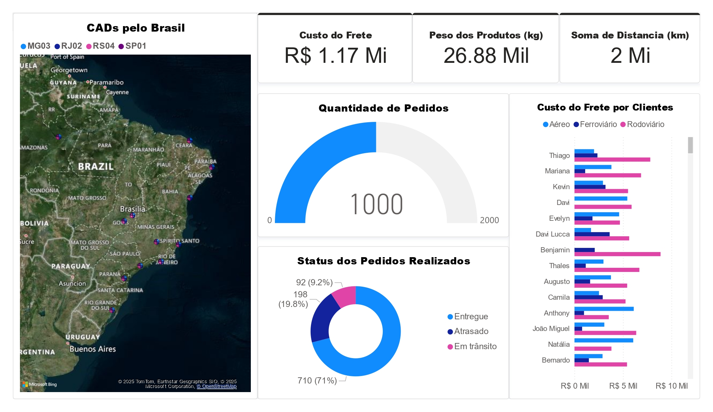

# 📊 Dashboard Logístico – Power BI & Python  

## 📌 Descrição  
Este projeto tem como objetivo **analisar dados logísticos** utilizando **Python** para tratamento da base e **Power BI** para criação de visualizações interativas.  
A base contém informações de pedidos, fretes, distâncias, modais de transporte, prazos de entrega e custos, permitindo avaliar indicadores como:  

- Taxa de entregas atrasadas por modal e cidade  
- Custo médio por km e por kg transportado  
- Tempo médio de entrega (Lead Time)  
- Distribuição de pedidos por região e armazém  

O projeto auxilia na **gestão da cadeia de suprimentos**, trazendo insights para otimização de custos, eficiência operacional e suporte à tomada de decisão.  

---

## 🛠️ Tecnologias Utilizadas  
- **Python** (Pandas, Faker, NumPy) → Geração e tratamento da base de dados  
- **Power BI** → Modelagem e visualização dos indicadores logísticos  
- **GitHub** → Versionamento e documentação do projeto  

---

## 📈 Resultado  

📊 Visualização principal do dashboard:  
  

Principais indicadores:  
- **Custo do frete total**  
- **Peso total dos produtos**  
- **Soma de distâncias percorridas**  
- **Quantidade de pedidos**  
- **Status das entregas (Entregues, Atrasadas, Em trânsito)**  
- **Distribuição de custos por modal e cliente**  

---

## 🤝 Contribuições  
Sugestões e melhorias são bem-vindas! Abra uma **issue** ou envie um **pull request**.  

---

## 👨‍💻 Autor  
**Marcos Vinicius Lima**  
[LinkedIn](https://www.linkedin.com/in/marcosdados/) | [GitHub](https://github.com/marcosengdados)  

